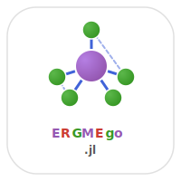

# ERGMEgo.jl


[](https://github.com/statistical-network-analysis-with-Julia/ERGMEgo.jl)
[](https://github.com/statistical-network-analysis-with-Julia/ERGMEgo.jl/actions/workflows/CI.yml?query=branch%3Amain)
[](https://statistical-network-analysis-with-Julia.github.io/ERGMEgo.jl/stable/)
[](https://statistical-network-analysis-with-Julia.github.io/ERGMEgo.jl/dev/)
[](https://julialang.org/)
[](https://opensource.org/licenses/MIT)

<p align="center">
  
</p>

ERGMs for Ego-Centric Network Data in Julia.

## Overview

ERGMEgo.jl provides tools for fitting ERGMs to egocentrically sampled network data. In ego-centric sampling, we observe a sample of "egos" along with their local networks (alters and ties among alters), enabling inference about population network properties.

This package is a Julia port of the R `ergm.ego` package from the StatNet collection.

## Installation

```julia
using Pkg
Pkg.add(url="https://github.com/statistical-network-analysis-with-Julia/ERGMEgo.jl")
```

## Features

- **EgoNetwork/EgoData types**: Data structures for ego samples
- **Ego-specific terms**: Adapted ERGM terms for ego data
- **Population size estimation**: Estimate network size from sample
- **Simulation**: Generate ego samples from complete networks

## Quick Start

```julia
using ERGMEgo

# Create ego network observations
ego1 = EgoNetwork(1, [1, 2, 3],    # ego=1, alters=[1,2,3]
                  [0 1 0; 1 0 1; 0 1 0])  # alter ties

ego2 = EgoNetwork(2, [1, 2],
                  [0 1; 1 0])

# Combine into EgoData
data = EgoData([ego1, ego2]; population_size=1000)

# Define terms
terms = [
    EgoEdges(),
    EgoTriangle(),
    EgoNodeMatch(:gender)
]

# Fit model
result = ergm_ego(data, terms; ppopsize=1000)
```

## EgoNetwork Structure

```julia
struct EgoNetwork{T}
    ego::T                          # Ego identifier
    alters::Vector{T}               # Alter identifiers
    alter_ties::Matrix{Bool}        # Ties among alters
    ego_attrs::Dict{Symbol, Any}    # Ego attributes
    alter_attrs::Dict{Symbol, Vector} # Alter attributes
end

# Create ego network
ego = EgoNetwork(
    1,                    # ego id
    [1, 2, 3, 4],        # alter ids
    alter_adj_matrix;
    ego_attrs=Dict(:age => 25, :gender => "M"),
    alter_attrs=Dict(:age => [23, 28, 22, 30])
)

# Query ego network
n_alters(ego)        # Number of alters
ego_degree(ego)      # Same as n_alters
n_alter_ties(ego)    # Ties among alters
alter_degree(ego)    # Degree of each alter within ego net
```

## EgoData Structure

```julia
struct EgoData{T}
    egos::Vector{EgoNetwork{T}}
    population_size::Union{Int, Nothing}
    sampling_weights::Vector{Float64}
end

# Create from list of ego networks
data = EgoData(egos; population_size=N, sampling_weights=w)

# Summary statistics
summary_stats(data)
# (n_egos, mean_degree, median_degree, min_degree, max_degree, ...)
```

## Data Preparation

```julia
# From DataFrame
data = as_egodata(df;
    ego_id=:respondent_id,
    alter_id=:alter_id,
    ego_attrs=[:age, :gender],
    alter_attrs=[:age, :gender]
)

# Specify survey design
data = ego_design(data; ppopsize=10000, weights=sample_weights)
```

## Ego-Specific Terms

### Structural Terms
```julia
EgoEdges()          # Edge count (estimates density)
EgoTriangle()       # Triangles (alter-alter ties create triangles with ego)
```

### Degree Terms
```julia
EgoDegree()         # Mean ego degree
EgoDegree(d)        # Proportion with degree d
EgoGWDegree(decay)  # Geometrically weighted degree
```

### Attribute Terms
```julia
EgoNodeMatch(:attr)     # Homophily (ego-alter matching)
EgoMixingMatrix(:attr)  # Full mixing patterns
```

## Model Fitting

```julia
# Fit ego ERGM
result = ergm_ego(data, terms;
    ppopsize=10000,    # Pseudo-population size
    method=:mple
)

# View results
println(result)
```

## Population Size Estimation

```julia
# Horvitz-Thompson estimator
N = estimate_popsize(data; method=:horvitz_thompson)

# Capture-recapture (from alter overlap)
N = estimate_popsize(data; method=:capture_recapture)
```

## Simulation

```julia
# Simulate ego sample from complete network
data = simulate_ego_sample(complete_net, n_egos;
    with_replacement=false,
    include_alter_ties=true
)
```

## Diagnostics

```julia
gof_result = ego_gof(result; statistics=[:degree, :alter_ties])
```

## Example: Social Survey

```julia
# General Social Survey ego network data
# Each respondent names up to 5 discussion partners

terms = [
    EgoEdges(),              # Network density
    EgoTriangle(),           # Clustering
    EgoNodeMatch(:race),     # Racial homophily
    EgoNodeMatch(:education) # Educational homophily
]

result = ergm_ego(gss_data, terms; ppopsize=250_000_000)

# Positive EgoNodeMatch(:race) → racial homophily in discussion networks
```

## Mathematical Background

Ego ERGMs use pseudo-likelihood methods to estimate ERGM parameters from ego samples. The key insight is that certain network statistics can be estimated from local (ego) observations:

- Density ≈ mean ego degree / (N-1)
- Triangles ≈ scaled alter-alter tie count
- Homophily ≈ ego-alter attribute matching rate

## Documentation

For more detailed documentation, see:

- [Stable Documentation](https://statistical-network-analysis-with-Julia.github.io/ERGMEgo.jl/stable/)
- [Development Documentation](https://statistical-network-analysis-with-Julia.github.io/ERGMEgo.jl/dev/)

## References

1. Krivitsky, P.N., Morris, M. (2017). Inference for social network models from egocentrically sampled data, with application to understanding persistent racial disparities in HIV prevalence in the US. *Annals of Applied Statistics*, 11(1), 427-455.

2. Krivitsky, P.N., Kolaczyk, E.D. (2015). On the question of effective sample size in network modeling: An asymptotic inquiry. *Statistical Science*, 30(2), 184-198.

3. Hunter, D.R., Handcock, M.S., Butts, C.T., Goodreau, S.M., Morris, M. (2008). ergm: A package to fit, simulate and diagnose exponential-family models for networks. *Journal of Statistical Software*, 24(3), 1-29.

## License

MIT License - see [LICENSE](LICENSE) for details.
